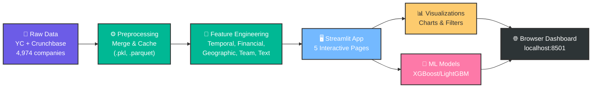

# Startup Success Prediction Using Machine Learning

**Team**: Qiyuan Zhu, Zella Yu  
**Course**: 7180 Final Project  
**GitHub**: https://github.com/vincentvicente/7180_final_project  
**Live Demo**: https://ycstartup-success-predictor.streamlit.app/

---

## Overview

Predict whether startups will succeed (Active/Acquired/IPO) or fail (Inactive) using machine learning on **4,974 Y Combinator companies** (2005-2024) integrated with Crunchbase funding data.

---

## Quick Start

### 🌐 Live Demo
**Access the deployed application**: [https://ycstartup-success-predictor.streamlit.app/](https://ycstartup-success-predictor.streamlit.app/) (Recommended)

### 🐳 Docker Deployment

**Prerequisites**:
- Docker installed ([Get Docker](https://docs.docker.com/get-docker/))
- Docker Compose (included with Docker Desktop)

#### Option 1: Docker Compose (Recommended)
```bash
# Clone the repository
git clone https://github.com/vincentvicente/7180_final_project.git
cd 7180_final_project

# Build and start the application
docker-compose up --build

# Or run in background (detached mode)
docker-compose up -d

# Stop the application
docker-compose down
```

#### Option 2: Docker CLI
```bash
# Build the image
docker build -t yc-startup-predictor .

# Run the container
docker run -p 8501:8501 --name startup-app yc-startup-predictor

# Or run in background
docker run -d -p 8501:8501 --name startup-app yc-startup-predictor

# Stop and remove container
docker stop startup-app
docker rm startup-app
```

**Access the app**: Open your browser to `http://localhost:8501`

**Docker Benefits**:
- ✅ No manual Python/dependency installation
- ✅ Consistent environment across all systems
- ✅ Easy deployment to cloud platforms (AWS, GCP, Azure)
- ✅ Built-in health checks and auto-restart
- ✅ Completely isolated from host system

---

## Data

**Sources**:
- Y Combinator: 4,974 companies (2005-2024)
- Crunchbase: 66,368 companies - matched 780 (15.7%) for funding data

**Class Distribution**:
- Success (Active/Acquired/Public): 82.9%
- Failure (Inactive): 17.1%

**Features**: `company_age`, funding metrics, industry, region, team size, TF-IDF text features

---

## Models & Performance

| Model | Accuracy | F1-Score | Precision | Recall | ROC-AUC |
|-------|----------|----------|-----------|--------|---------|
| Logistic Regression | 63.9% | 0.47 | 0.61 | 0.58 | 0.68 |
| Random Forest | 67.3% | 0.57 | 0.65 | 0.62 | 0.72 |
| XGBoost | 67.3% | 0.55 | 0.66 | 0.64 | 0.74 |
| LightGBM | **68.1%** | **0.58** | **0.67** | **0.65** | **0.75** |

**Evaluation**: Confusion matrix as primary metric  
**Imbalance Handling**: SMOTE + class weighting + stratified split

---

## Application Workflow



**Key Pages**: 🏠 Home | 🔍 Data Explorer | 📊 Model Performance | 🎯 Interactive Prediction | 🌍 Regional Analysis

---

## Application Features

1. **Home** - Dataset statistics & class distribution
2. **Data Explorer** - Filter by industry/region, interactive EDA
3. **Model Performance** - Confusion matrices, metric comparison, feature importance
4. **Interactive Prediction** - Real-time success probability calculator
5. **Regional Analysis** - Geographic success patterns

---

## Jupyter Notebooks

The `notebooks/` directory contains detailed analysis and model development:

### 📊 `01_data_analysis_and_eda.ipynb`
- **Purpose**: Comprehensive exploratory data analysis
- **Contents**:
  - Data loading and merging (YC + Crunchbase)
  - Missing value analysis
  - Target variable distribution and class imbalance
  - Feature distributions (numerical and categorical)
  - Success rate analysis by industry and region
  - Correlation analysis and feature relationships

### 🤖 `02_model_training.ipynb`
- **Purpose**: Complete model training pipeline
- **Contents**:
  - Feature preprocessing and encoding
  - Train-test split with stratification
  - SMOTE for handling class imbalance
  - Training multiple models (Logistic Regression, Random Forest, Gradient Boosting)
  - Model comparison and evaluation
  - Detailed metrics (Accuracy, Precision, Recall, F1, ROC-AUC)
  - Confusion matrices and ROC curves
  - Feature importance analysis
  - Cross-validation results

**To run the notebooks**:
```bash
# Install Jupyter (if not already installed)
pip install jupyter

# Launch Jupyter Lab
jupyter lab

# Or Jupyter Notebook
jupyter notebook
```

---

## Project Structure

```
7180_final_project/
├── app/
│   ├── app.py              # Streamlit application
│   └── data_config.py      # Data loading configuration
├── src/
│   ├── data/               # Preprocessing modules
│   ├── features/           # Feature engineering & text processing
│   ├── models/             # Model training & evaluation
│   └── visualization/      # Plotting functions
├── notebooks/
│   ├── 01_data_analysis_and_eda.ipynb     # Exploratory data analysis
│   └── 02_model_training.ipynb             # Model training & evaluation
├── data/
│   ├── raw/                # Raw YC and Crunchbase datasets
│   └── processed/          # Preprocessed cached data (.pkl, .parquet)
├── Dockerfile              # Docker container configuration
├── docker-compose.yml      # Docker Compose setup
├── .dockerignore           # Docker build exclusions
├── requirements.txt        # Python dependencies
├── preprocess_data.py      # Data preprocessing script
└── README.md               # Project documentation
```

---

## Addressing Instructor Feedback

✅ **Pre-curated Metrics**: Interactive dashboards with success rates by industry/region  
✅ **Class Imbalance**: SMOTE + class weighting + confusion matrix as primary metric  
✅ **Feature Engineering**: `company_age` feature (became top-3 predictor)  
✅ **Text Processing**: TF-IDF vectorization + keyword extraction

---

## Technical Highlights

**Data Integration**:
- Multi-strategy matching: name normalization → domain matching → fuzzy matching
- 780 companies (15.7%) with verified Crunchbase funding data
- Industry-median imputation for remaining companies

**Feature Engineering**:
- `company_age` = 2024 - year_founded
- Funding ratios, temporal features, location indicators
- TF-IDF (100 features) from tags & descriptions

**Model Training**:
- SMOTE for synthetic minority oversampling
- Class weighting in all models
- Stratified train-test split
- Hyperparameter tuning with GridSearchCV

---

## Requirements

- Python 3.10+
- Key packages: streamlit, pandas, numpy, scikit-learn, xgboost, lightgbm

See `requirements.txt` for full list.

---